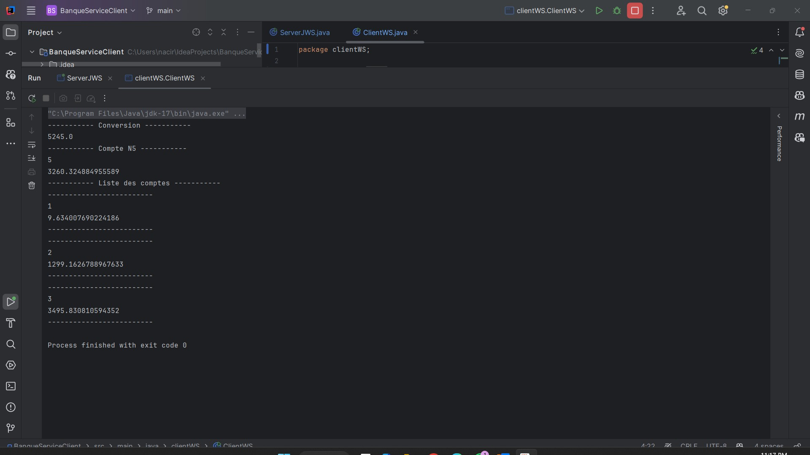

# Service Web SOAP

### 1. Démarrer le serveur JAX-WS sur le port 9191

### 2. Consulter le schéma XML à partir du fichier WSDL

### 3. Tester le service web à l'aide de SoapUI

### 4. Générer un stub côté client et effectuer les tests du service web via le client WS

### 5. Un schéma résumant l'architecture d'un service web basé sur SOAP
